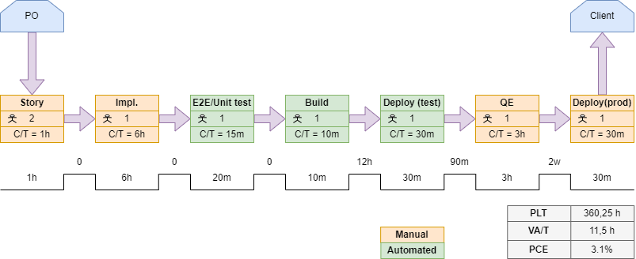
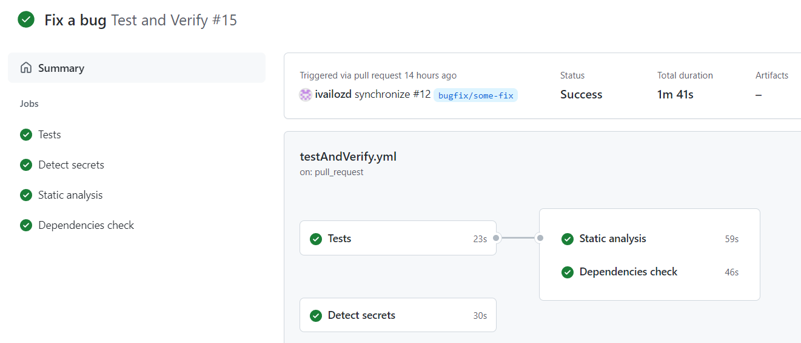

# devops-upskill
Final project - [Upskill DevOps](https://www.telerikacademy.com/upskill/devops)

This repo introduces CI in the [Gitflow workflow](https://www.atlassian.com/git/tutorials/comparing-workflows/gitflow-workflow) branching strategy. 
The aim is to guarantee the delivered software's quality and make the deployment to the test and production environment easier by:
- automation of the unit testing
- automation of the static code analysis
- automation of the dependency vulnerability check
- automation of the artifact's building and deployment
- automation of the container's building and deployment

## Feature delivery - VSM

Automate the processes in green:

## Scenarios

### Open a pull request towards `develop` or `main`
Cases:
* implement a feature
* resolve a bug
* prepare a release

### Push to `main`or `develop`
Cases:
* release a new version
* merge a feature/bug

## End-to-end tests
https://github.com/ivailozd/devops-upskill-test/

## Things to do
* deploy the artifacts to a artifactory

## Next goals
* automate QE testing
* follow a more straightforward branching strategy for simplifying CI
* automate test and staging environments deployment

## Further goals
* implement CD