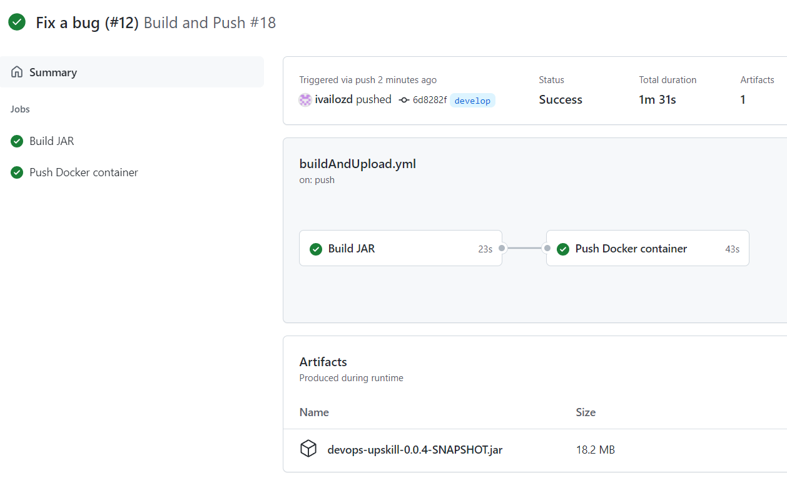

# devops-upskill
Final project - [Upskill DevOps](https://www.telerikacademy.com/upskill/devops)

This repo introduces CI in the [Gitflow workflow](https://www.atlassian.com/git/tutorials/comparing-workflows/gitflow-workflow) branching strategy. 
The aim is to guarantee the delivered software's quality and make the deployment to the test and production environment easier by:
- automation of the unit testing
- automation of the static code analysis
- automation of the dependency vulnerability check
- automation of the artifact's building and deployment
- automation of the container's building and deployment

## Feature delivery - VSM

Automate the processes in green:

## Workflows

### Open a pull request towards `develop` or `main`
Cases:
* implement a feature
* resolve a bug
* prepare a release

### Push to `main`or `develop`
Cases:
* release a new version
* merge a feature/bug

## End-to-end tests
https://github.com/ivailozd/devops-upskill-test/

## Bring in SCA (Software composition analysis)
### Why SCA?
* keep track of all third-party dependencies' licenses and vulnerabilities
* fix any issues early in the SDLC

### Why Snyk
* supports `Java` and `Maven`
* free and easy for start - just create an accound and configure the project
* easy integration with Git and the developer's IDE
* automated fix pull requests
* industry-leading security intelligence database

### Comparison to others?
#### WhiteSource ([link](https://www.whitesourcesoftware.com/))
pros:
* highly scalable
* easy to use developer tools

cons:
* no trial period

#### Synopsys/Black Duck ([link](https://www.blackducksoftware.com/))
pros:
* the best governance solution (audit and risk reporting)

cons:
* no trial period
* the most expensive
* reports for scalability issues and high false-positive rate for vulnerabilities

#### Snyk ([link](https://snyk.io/))
pros:
* straightforward integration into the SDLC

cons:
* poor governance solution (audit and risk reporting)

### What configuration do we need?
* Configure the project to Snyk
* Configure a job in [testAndVerify.yml](./.github/workflows/testAndVerify.yml)

## Bring in SAST (Static application security testing)
// TODO

## Things to do
* deploy the artifacts to an artifactory
* scan the containers for vulnerabilities

## Next goals
* automate QE testing
* follow a more straightforward branching strategy for simplifying CI
* automate test and staging environments deployment
* bring in DAST (Dynamic application security testing)

## Further goals
* implement CD
